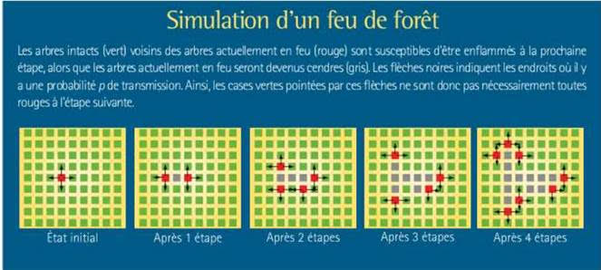

# Forest Fire Simulation

The goal is to implement a simple algorithm for simulating the spread of a forest fire.

## Rules

The forest is represented by a grid of dimension h x l.

The time dimension is discretized. The simulation progresses step by step.

In the initial state, one or more cells are on fire.

If a cell is on fire at step t, then at step t+1:

- The fire extinguishes in that cell (the cell turns into ash and cannot burn again)
  
- and there is a probability p that the fire spreads to each of the 4 adjacent cells

The simulation stops when there are no more cells on fire.

## Notes

This project was documented in French.
